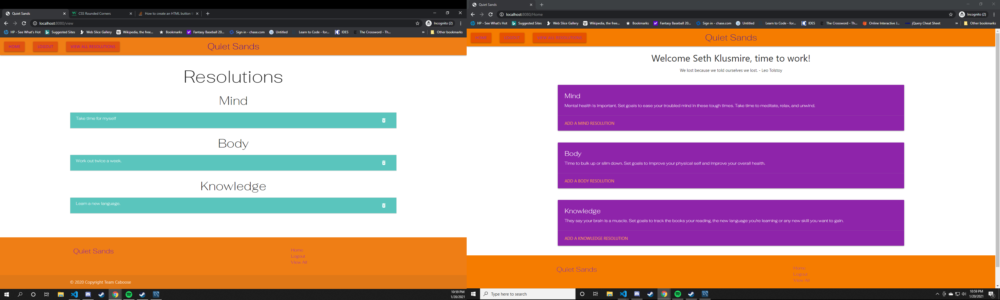

# Quiet Sands: Help in the New Year

## Description
Get a leg up on your New Years resolutions. Keep track of mind, body and knowledge resolutions with Quiet Sand.

## Table of Contents

* [Description](#description)
* [Installation](#installation)
* [Usage](#usage)
* [Contributing](#contributing)
* [License](#license)
* [Question](#questions)

## Installation
Install necessary dependencies with npm i command.

## Usage
Command line application requiring npm packages mysql2, passport, check-password-strength, passport-local, sequelize, path, bcryptjs, express, express-handlebars and express-session.

## Screenshot

## Contributing
Seth Klusmire, Zack Noe and Wesley Young

## License
MIT

## Links
https://github.com/wyoung60/project2

## Questions
Email and Github profiles: [sethklusmire@gmail.com](sethklusmire@gmail.com)
[zackarynoe@gmail.com](zackarynoe@gmail.com)
[Wyoung552@yahoo.com](Wyoung552@yahoo.com)
https://github.com/sethklusmire 
https://github.com/spaced-lord
https://github.com/wyoung60 